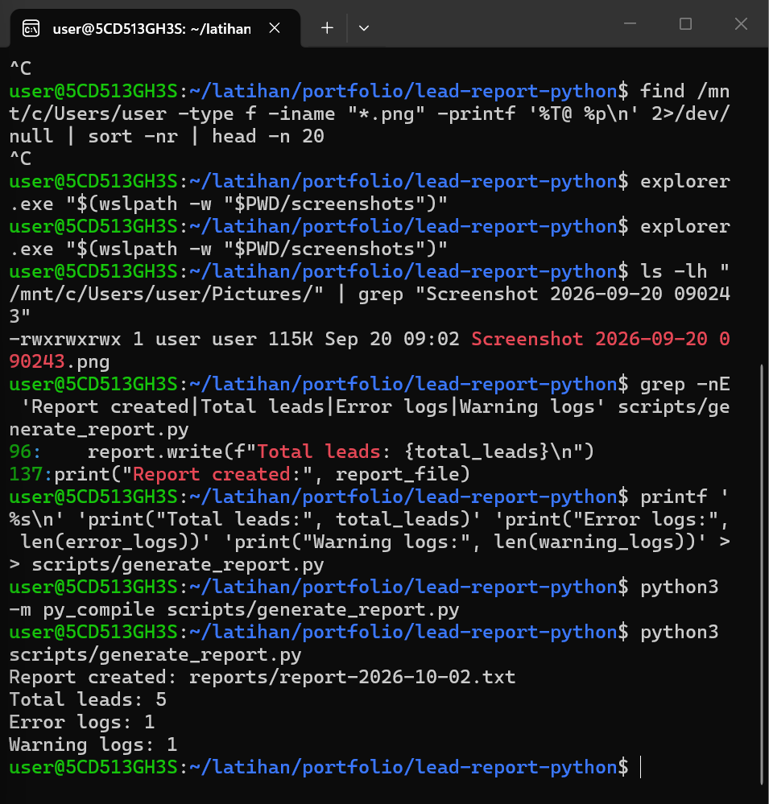

# Lead Report Python


Project automation menggunakan Python untuk membaca data lead dari file CSV, menganalisis log aplikasi, memvalidasi file input, dan membuat laporan otomatis.
## Masalah

Dalam pekerjaan digital dan remote operation, data leads sering dikumpulkan dari banyak sumber seperti website, WhatsApp, iklan, referral, atau form online.

Tim perlu mengetahui:

- Berapa total leads yang masuk
- Berapa leads yang masih baru
- Berapa leads yang sudah dihubungi
- Berapa leads yang sudah qualified
- Apakah ada error atau warning di log aplikasi
- Apakah report harian bisa dibuat otomatis

Kalau semua dicek secara manual, prosesnya lebih lambat dan rawan terlewat.

## Solusi

Project ini menggunakan Python untuk:

- Membaca file `data/leads.csv`
- Membaca file `data/app.log`
- Menghitung leads berdasarkan status
- Menghitung log ERROR dan WARNING
- Membuat report harian ke folder `reports/`
- Memberikan pesan error yang ramah jika file atau kolom CSV bermasalah

## Fitur

- Membaca data lead dari file CSV
- Menghitung jumlah lead berdasarkan status
- Memfilter lead dengan status `new`
- Membaca application log
- Mendeteksi log `ERROR` dan `WARNING`
- Memeriksa keberadaan file input
- Memeriksa keberadaan folder laporan
- Memvalidasi kolom wajib pada file CSV
- Menangani kondisi file CSV kosong
- Membuat laporan otomatis berdasarkan tanggal

## Tools yang Digunakan

- Python 3
- Modul `csv`
- Modul `pathlib`
- Modul `datetime`
- Git
- GitHub
- VS Code
- Terminal

## Struktur Project

```text
lead-report-python/
├── README.md
├── .gitignore
├── data/
│   ├── leads.csv
│   └── app.log
├── reports/
│   ├── .gitkeep
│   └── sample-report.txt
├── scripts/
│   ├── generate_report.py
│   ├── read_csv.py
│   ├── filter_new_leads.py
│   └── count_leads_by_status.py
├── screenshots/
│   └── terminal-output.png
├── VERSION
└── CHANGELOG.md
```

## Contoh Data

### Data Lead

```csv
name,email,source,status
Budi,budi@example.com,WhatsApp,new
Sari,sari@example.com,Website,contacted
Andi,andi@example.com,Instagram,new
Rina,rina@example.com,Facebook Ads,qualified
Dewi,dewi@example.com,Referral,new
```

### Application Log

```text
INFO: Application started
INFO: New lead received from WhatsApp
WARNING: Email field is empty for one lead
ERROR: Failed to send notification
INFO: Application finished
```

## Cara Menjalankan

Pastikan berada di folder project:

```bash
cd ~/latihan/portfolio/lead-report-python
```

Jalankan generator laporan:

```bash
python3 scripts/generate_report.py
```

Laporan akan dibuat di folder:

```text
reports/report-YYYY-MM-DD.txt
```

### Output Terminal

```text
Report created: reports/report-2026-10-02.txt
Total leads: 5
Error logs: 1
Warning logs: 1
```

## Contoh Hasil

```text
Lead Report Generator
=====================
Date: 2026-10-02

Lead Summary
------------
Total leads: 5
New leads: 3
Contacted leads: 1
Qualified leads: 1

Application Log Summary
-----------------------
Total error logs: 1
Total warning logs: 1
```

## Generated Report

Script membuat report harian di dalam folder `reports/`.

Contoh:

```text
reports/report-2026-10-02.txt
```

Untuk contoh report yang disimpan di repository:

```text
reports/sample-report.txt
```

Report harian tidak perlu semuanya disimpan di Git karena sudah diatur oleh `.gitignore`.

## Error Handling

Script memeriksa:

- Apakah `data/leads.csv` tersedia
- Apakah `data/app.log` tersedia
- Apakah folder `reports/` tersedia
- Apakah CSV memiliki kolom yang dibutuhkan
- Apakah CSV memiliki setidaknya satu lead

Jika terjadi masalah, script memberikan pesan error yang jelas dan ramah.

Contoh:

```text
ERROR: Leads file not found.
Expected file: data/leads.csv
Please create data/leads.csv first.
```

## Yang Saya Pelajari

Dari project ini, saya belajar:

- Sintaks dasar Python
- Variables
- Membaca text files
- Membaca CSV files
- Looping data
- Conditional statements
- Menghitung data berdasarkan status
- Membuat text report
- Basic error handling
- Validasi file dan data
- Menulis dokumentasi project
- Menyiapkan project portfolio di GitHub
- Menggunakan Git dan GitHub

## Catatan Portfolio

Project ini merupakan bagian dari perjalanan belajar saya untuk membangun kemampuan practical automation yang dapat digunakan untuk pekerjaan remote.

Fokus utama:

- Python automation basics
- Data processing
- Log checking
- Report generation
- Error handling
- Clean documentation
- GitHub portfolio building

## Perbaikan Berikutnya

Pengembangan berikutnya yang dapat dilakukan:

- Export report ke CSV
- Export report ke Excel
- Mengirim report melalui email
- Mengirim report melalui Telegram
- Menjadwalkan pembuatan report
- Membuat dashboard sederhana
- Menghubungkan project dengan workflow n8n

## Screenshot


